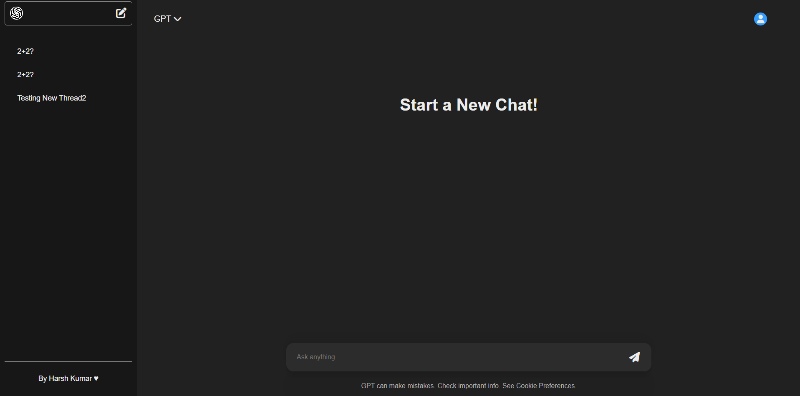

# GPT Chat – AI Chatbot Using OpenAI GPT-4o Mini

A fully functional **ChatGPT-like web application** built using the **OpenAI GPT-4o-mini model**, **MERN Stack**, and **Render** for deployment.  
It allows users to create multiple chat threads, store previous conversations, and interact with AI in real time.

---
## Screenshots

### 🖥️ Chat Interface

## Features

- Chat with OpenAI’s **GPT-4o-mini** in real time  
- Create, switch, and delete chat threads  
- **Persistent chat history** stored in MongoDB  
- Responsive UI built with React + Vite  
- Backend + Frontend deployed on Render

---

## Tech Stack

### Frontend
- React (Vite)
- Context API for state management
- CSS3 for styling

### Backend
- Node.js with Express
- MongoDB + Mongoose
- OpenAI API (GPT-4o-mini)
- Deployed on Render

---

## Contributors
- **Harsh Kumar** - Developer

